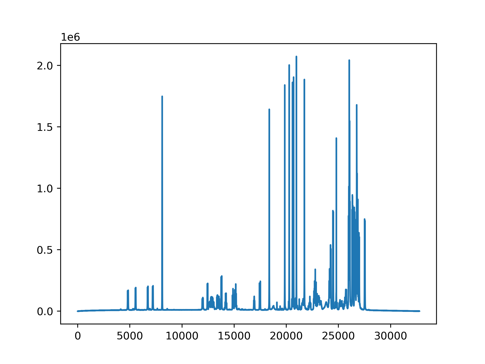

Using bruker_utils
==================

The purpose of bruker_utils is to make it convienient to work with Bruker NMR
data with Python. On this page is an outline of how to use the available
features.

The :py:class:`BrukerDataset <bruker_utils.BrukerDataset>` class
----------------------------------------------------------------

Importing a dataset
^^^^^^^^^^^^^^^^^^^

To import a dataset, you can do the following:

.. code:: pycon

    >>> from bruker_utils import BrukerDataset
    >>> dataset = BrukerDataset('data/1')

You can see basic information about the dataset by printing it:

.. code:: pycon

    >>> print(dataset)
    <bruker_utils.BrukerDataset at 0x7f60f6d2b780>
    Dataset directory:   /home/simon/data/1
    Dimensions:          1
    Data type:           Time domain
    Parameter filenames: acqus

We see the absolute path to the directory given,
the number of dimensions the experiment has, the type of data, and the
names of associated parameter files.

The type of data can be either raw time-domain data (i.e. to raw output from
the spectrometer), or processed spectral data.

Directory requirements
^^^^^^^^^^^^^^^^^^^^^^

If you wish to work with the time-domain data, the path you supply to
``BrukerDataset`` should contain the raw data file. This file will be called
either ``fid`` or ``ser``, depending on the number of dimensions in your
experiment.

.. code:: text

    ~/data/1: ls
    .rw-rw-r-- 8.9k simon 11 Sep 12:53 acqu
    .rw-rw-r-- 9.3k simon 11 Sep 12:53 acqus
    .rw-rw-r-- 1.1k simon 11 Sep 12:53 audita.txt
    .rw-rw-r--  45k simon 11 Sep 12:53 cyclosporina.pdb
    .rw-rw-r-- 261k simon 11 Sep 12:53 fid <-- Here is the file we need!
    .rw-rw-r-- 2.5k simon 11 Sep 12:53 format.temp
    drwxrwxr-x    - simon 11 Sep 12:53 pdata
    .rw-rw-r-- 1.9k simon 11 Sep 12:53 pulseprogram
    .rw-rw-r--  495 simon 11 Sep 12:53 scon2
    .rw-rw-r--  18k simon 11 Sep 12:53 uxnmr.par

To work with processed data, the path should contain the processed data file.
This will be one of ``1r``, ``2rr``, or ``3rrr``, depending on the number
of dimensions in the experiment (bruker_utils only supports up to 3D data
currently I'm afraid).

.. code:: text

    ~/data/1$ cd pdata/1
    ~/data/1/pdata/1$ ls
    .rw-rw-r-- 131k simon 11 Sep 12:53 1i
    .rw-rw-r-- 131k simon 11 Sep 12:53 1r <-- Here is the file we need!
    .rw-rw-r-- 1.9k simon 11 Sep 12:53 auditp.txt
    .rw-rw-r--  770 simon 11 Sep 12:53 cmcq
    .rw-rw-r--  538 simon 11 Sep 12:53 outd
    .rw-rw-r-- 1.4k simon 11 Sep 12:53 parm.txt
    .rw-rw-r-- 2.2k simon 11 Sep 12:53 proc
    .rw-rw-r-- 2.2k simon 11 Sep 12:53 procs
    .rw-rw-r-- 2.8k simon 11 Sep 12:53 thumb.png
    .rw-rw-r--   14 simon 11 Sep 12:53 title

On top of the need for a valid datafile, the directory specified should also
have certain acquisition and processing parameter files associated with it.
For each type of experiment,
the complete list of expected files can be found in the documentation for
:py:class:`BrukerDataset <bruker_utils.BrukerDataset>`, under the section
`Parameters`.

In the example above, time-domain data was imported, and as shown, there is
processed data associated with it in the directory ``data/1/pdata/1``.
We can therefore import it as follows:

.. code:: pycon

    >>> dataset = BrukerDataset('data/1/pdata/1')
    >>> print(dataset)
    <bruker_utils.BrukerDataset at 0x7f60f6d37da0>
    Dataset directory:   /home/simon/data/1/pdata/1
    Dimensions:          1
    Data type:           Processed data
    Parameter filenames: acqus,procs

Accessing Parameters
^^^^^^^^^^^^^^^^^^^^

`I am working with a 1D processed dataset in the following section.`

Parameters can be parsed from ``acqus`` and ``procs`` files using the
:py:meth:`~bruker_utils.BrukerDataset.get_parameters` method. A dictionary
is returned with entries associated with each parameter file:

.. code:: pycon

    >>> params = dataset.get_parameters()
    >>> for key in params.keys():
    ...     print(key)
    ... 
    acqus
    procs
    >>> for key, value in params['acqus'].items():
    ...     print(f'{key} --> {value}')
    ... 
    ACQT0 --> -2.26890760309556
    AMP --> [100, 100, 100, 100, 100, 100, 100, 100,
    100, 100, 100, 100, 100, 100, 100, 100, 100, 100,
    100, 100, 100, 100, 100, 100, 100, 100, 100, 100,
    100, 100, 100, 100]
    AMPCOIL --> [0, 0, 0, 0, 0, 0, 0, 0, 0, 0, 0, 0,
    0, 0, 0, 0, 0, 0, 0, 0, 0, 0, 0, 0, 0, 0, 0, 0, 0,
    0, 0, 0, 0]
    AQSEQ --> 0
    AQ_mod --> 3
    AUNM --> <au_zg>
    AUTOPOS --> <>
    BF1 --> 500.13
    BF2 --> 500.13
    BF3 --> 500.13
    BF4 --> 500.13
    BF5 --> 500.13
    BF6 --> 500.13
    BF7 --> 500.13
    BF8 --> 500.13
    --snip--
    ZL2 --> 120
    ZL3 --> 120
    ZL4 --> 120
    scaledByNS --> no
    scaledByRG --> no

By default, the parameters from all relavent files are returned. If you
are interesed in parameters from a particular file, you can you the
``filenames`` argument:

.. code:: pycon

    >>> params = dataset.get_parameters(filenames='acqus')
    >>> # Only one item with the key 'acqus' should exist
    >>> for key in params.keys():
    ...     print(key)
    ...
    acqus
    >>> sw = params['acqus']['SW_h']
    >>> print(f'The experiment sweep width was {sw:.4f}Hz')
    The experiment sweep width was 5494.5055Hz

For a full list of valid file names, you can use
:py:meth:`~bruker_utils.BrukerDataset.valid_parameter_filenames`:

.. code:: pycon

    >>> dataset.valid_parameter_filenames
    ['acqus', 'procs']

Accessing the Data
^^^^^^^^^^^^^^^^^^

`I am working with a 1D processed dataset in the following section.`

The data can be obtained in `NumPy <https:\\numpy.org>`_ format, using
the :py:meth:`~bruker_utils.BrukerDataset.data` property:

.. code:: pycon

    >>> data = dataset.data
    >>> print(data.shape)
    (32768,)
    >>> import matplotlib.pyplot as plt
    >>> plt.plot(data)
    [<matplotlib.lines.Line2D object at 0x7fb5aa2c4a90>]
    >>> plt.show()

Accessing Chemical Shifts/Timepoints
^^^^^^^^^^^^^^^^^^^^^^^^^^^^^^^^^^^^

To obtain chemical shifts for processed data, or timepoints for time-domain
data, use the :py:meth:`~bruker_utils.BrukerDataset.get_samples` method:

.. code:: pycon
    
    >>> import bruker_utils as butils
    >>> # 1d time-domain data
    ... 
    >>> fid_1d = butils.BrukerDataset('data/1')
    >>> fid_1d.get_samples()
    [array([0.000000e+00, 1.820000e-04, 3.640000e-04, ..., 5.949398e+00,
           5.949580e+00, 5.949762e+00])]
    >>> # 1d processed data
    ... 
    >>> pdata_1d = butils.BrukerDataset('data/1/pdata/1')
    >>> pdata.get_samples(meshgrid=False) 
    >>> pdata_1d.get_samples()
    [array([ 9.99027508,  9.9899398 ,  9.98960452, ..., -0.99515954,
           -0.99549482, -0.9958301 ])]
    >>> # 2d time-domain data
    ... 
    >>> fid_2d = butils.BrukerDataset('data/2')
    >>> fid_2d.get_samples(meshgrid=False)  # more on meshgrid later...
    [array([0.00000e+00, 4.88000e-05, 9.76000e-05, ..., 9.72096e-02,
           9.72584e-02, 9.73072e-02]), array([0.       , 0.0001966,
           0.0003932, ..., 0.024575 , 0.0247716, 0.0249682])]
    >>> # 2d processed data
    ... 
    >>> pdata_2d = butils.BrukerDataset('data/2/pdata/1')
    >>> pdata_2d.get_samples(meshgrid=False)
    [array([154.23232066, 154.15272382, 154.07312698, ...,  -8.54322199,
            -8.62281884,  -8.70241568]), array([ 9.66018073,  9.65023914,
            9.64029755, ..., -0.49018526, -0.50012685, -0.51006844])]

The ``meshgrid`` argument for N-dimensional data takes the samples for
each dimension and creates N-dimensional grids to create co-ordinate
matrices. This is very useful when it comes to plotting multidimensional
signals. **Note that by default this is set to** ``True``.

Advice for Plotting Data
------------------------

Plotting nice figures of NMR data is very simple with the help of
bruker_utils, if you are familiar with `matplotlib <https:\\matplotlib.org>`_.
Here is an outline of the basic steps needed to create a plot.

1D Example
^^^^^^^^^^

